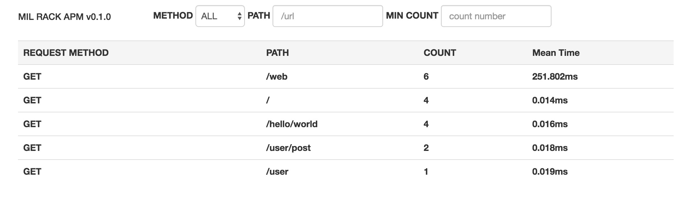

# Mil Rack Apm #

轻量级的链接使用次数统计的rack插件, 基本只对请求类型, 链接, 调用次数, 平均响应做统计.(过滤参数)

依赖redis

## 安装 ##

安装gem:

```
gem install redis
gem install mil-rack_apm
```

或在你的Gemfile中添加:

```ruby
# Gemfile
gem 'mil-rack_apm'

```

然后运行 `bundle install` .


## 初始化 ##

你需要将实例化一个redis的配置给mil-rack_apm

```ruby
redis = Redis.new
Mil::RackApm.redis = redis
```

需要进行统计时,在rack添加中间件

```ruby
use Mil::RackApm::Data
```

需要查看统计时,在rack中添加一个链接,例如

```ruby
map '/web' do
  run Mil::RackApm::Web.new
end
```

这样你可以在 **/web** 进行查看



## 已有问题 ##

1. 为了过滤动态参数,对链接中混合英文和数字,纯数字的路径段进行了文本替换,例如:
 
```ruby
# 原始path
/hello/world111000222

# 会统计为
/hello/:obj
```
2. png|css|jpg|js|ico|jpeg|gif|bmp 结尾的path不会计入统计

## Copyright ##

Copyright © 2011-2016. See [LICENSE](https://github.com/millim/mil-rack_apm/blob/master/LICENSE.txt) for details.
